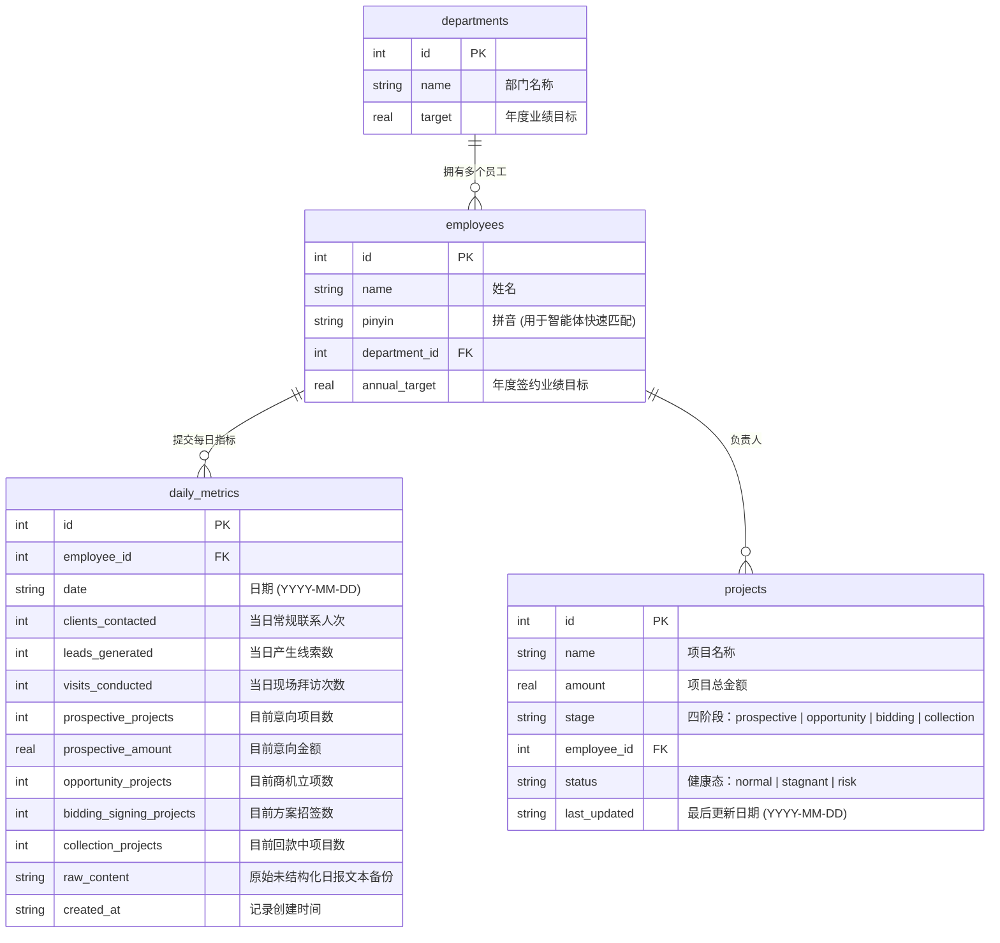

# 谛听 (Diting) - OKR & MTL 可视化大屏与智能体 CLI 写入工具

> **不用人盯的运营，不会跑偏的战略**

谛听 (Diting) 是面向现代数字化企业设计的高端 **OKR & MTL (Market to Lead) 战略运营大屏** 及 **智能体非结构化数据自动归档工具**。系统整合了 SQLite 原生数据底座、高性能 Node.js 后端、React 极致毛玻璃特效大屏以及 Commander.js 智能体对接工具，构建了一套“从日报文本自动抓取 -> 数据库智能分析 -> 战略走势全景渲染 -> 飞书异常一键督办”的闭环运营体系。

---

## 🌟 核心亮点

### 1. 🌌 极致视觉美学 (Premium Glassmorphism Design)
- **深邃流动渐变**: 全屏采用 `linear-gradient` 高端多色相暗黑流动背景，配合平滑缓动动画。
- **极致毛玻璃质感**: 完美应用 `backdrop-filter: blur(24px)` 结合超细发光边框，在各种分辨率下均表现得晶莹剔透。
- **霓虹呼吸警示**: 对年度目标、签约、回款、高危等不同卡片单独使用微发光投影和 CSS Pulse 脉冲呼吸灯动效。

### 2. 🤖 智能体无缝对接 (AI Agent Skill CLI)
- **非结构化日报解析**: 提供配套的 AI Agent 技能模板，自动从员工的自由口语化日报（如微信或飞书消息）中，精准提取核心业绩和管线变化指标。
- **极简 Commander 命令行**: 提供 `diting` ([cli.js](file:///Users/scott/Documents/01-开发项目/Web应用/OKR_Visiualization/cli.js)) 工具。智能体只需调用 `--employee`、`--date`、`--raw` 等参数即可瞬间完成事务级安全落库，实现“AI 自动解析，系统自动记账”。

### 3. 📊 MTL 销售全生命周期漏斗 (Full Funnel Analytics)
- **多维大盘看板**: 汇总展示**年度目标业绩进度**（含完成度动态波浪进度条）、**已签约销售额**、**已收财务回款**（含到账率进度条）和**蓄水池销售管线**等四大 OKR 核心 KPI。
- **线索到回款全链路**: 自定义 Recharts 图表，平滑过渡展示从“接触客户”到“线索生成”、“现场拜访”、“意向推进”、“商机立项”、“签约招标”直至“回款结案”的 7 阶段营销漏斗。
- **爬坡演进面积图**: 累计统计并渲染 30 天内签约与回款的双曲线演化进程。

### 4. 🏆 绩效龙虎榜与 360° 画像钻取 (Drill-Down Detail)
- **团队龙虎榜单**: 动态计算并展示销售团队中各个部门及成员的年度目标完成率、30天接触/拜访次数等过程指标，排行清晰。
- **画像弹窗钻取**: **点击任意员工姓名**即可弹出 360° 画像，详细显示个人项目明细及**最近 15 篇最原始非结构化日报文本备份**。

### 5. 🚨 实时督办与飞书催收 (Feishu Real-time Reminding)
- **自动催交检测**: 智能排查特定日期未交日报的员工，飞书智能体可每日定时检测。
- **一键催办/督收**: 大屏自动预警今日漏交日报人员、超 7 天未跟进停滞项目、烂尾高危大单。点击即可调用系统 `/api/ping-employee` 一键模拟发送飞书警告，极速纠偏。

---

## 🛠️ 项目技术栈

- **前端大屏**:
  - `React.js` (v18.3.1) - 组件化界面开发
  - `Vite` (v5.3.1) - 极速现代前端构建工具
  - `Recharts` (v2.12.7) - 高性能 Canvas/SVG 响应式可视化图表
  - `Lucide React` (v0.395.0) - 现代简约风格图标库
  - `Vanilla CSS` - 极致动效与毛玻璃质感的核心实现
- **后端 API**:
  - `Express.js` (v4.19.2) - RESTful API 接口搭建
  - `node:sqlite` (Node.js 原生 SQLite 模块) - 无需外部驱动的极速高性能事务数据库同步操作
  - `CORS` - 跨域资源共享配置
- **命令行工具**:
  - `Commander.js` (v12.1.0) - CLI 命令行交互构建
- **AI 智能体技能**:
  - 预设 AI Prompt 技能，位于 [.claude/skills/daily-report-archiver/SKILL.md](file:///Users/scott/Documents/01-开发项目/Web应用/OKR_Visiualization/.claude/skills/daily-report-archiver/SKILL.md)

---

## 📂 核心代码与目录结构说明

- [cli.js](file:///Users/scott/Documents/01-开发项目/Web应用/OKR_Visiualization/cli.js): Diting 智能体数据落库与统计 CLI 核心实现，支持 `save-report` 和 `check-missing`。
- [package.json](file:///Users/scott/Documents/01-开发项目/Web应用/OKR_Visiualization/package.json): 项目依赖及脚本管理。
- [vite.config.js](file:///Users/scott/Documents/01-开发项目/Web应用/OKR_Visiualization/vite.config.js): 配置 Vite 前端服务器，包含 API 跨域反向代理 (`/api` -> `localhost:3001`)。
- **db/**: 数据库与初始化种子目录
  - [schema.sql](file:///Users/scott/Documents/01-开发项目/Web应用/OKR_Visiualization/db/schema.sql): 谛听核心 SQLite 数据模型 Schema（部门、员工、每日汇总指标、活跃项目）。
  - [seed.js](file:///Users/scott/Documents/01-开发项目/Web应用/OKR_Visiualization/db/seed.js): SQLite 高真模拟数据初始化脚本，自动生成 30 天内的完整日报与项目流转周期数据。
- **server/**: Express 后端服务
  - [index.js](file:///Users/scott/Documents/01-开发项目/Web应用/OKR_Visiualization/server/index.js): 数据库 API 聚合层，支持各种日期区间过滤、看板统计、龙虎榜排行、个人 360° 下钻查询及飞书 Webhook 模拟推送接口。
- **src/**: React 前端组件与样式
  - [App.jsx](file:///Users/scott/Documents/01-开发项目/Web应用/OKR_Visiualization/src/App.jsx): 大屏全量前端交互实现，包括选项卡切换、看板流转、下钻弹窗、气泡通知 (Toast) 等。
  - [index.css](file:///Users/scott/Documents/01-开发项目/Web应用/OKR_Visiualization/src/index.css): 极致毛玻璃设计系统全局样式表。

---

## 📊 数据库模型设计 (Database Schema)



---

## 🤖 智能体 CLI 工具使用指南 (`diting`)

`cli.js` 允许外部智能体（如飞书智能体或本地 Agent）解析出结构化 JSON 后，执行事务级别的安全落库。

### 1. 自动录入日报与项目卡片 (`save-report`)
```bash
node cli.js save-report \
  --employee "员工姓名或拼音" \
  --date "2026-05-25" \
  --raw "今日联系了碧桂园和恒大，已进行现场拜访。碧桂园项目正式进入商机立项，意向金额约60万。" \
  --metrics '{"clients_contacted":2,"leads_generated":1,"visits_conducted":1,"prospective_projects":0,"prospective_amount":0,"opportunity_projects":1,"bidding_signing_projects":0,"collection_projects":0}' \
  --projects '[{"name":"碧桂园高端系统采购项目","amount":600000,"stage":"opportunity","status":"normal"}]'
```

### 2. 检查特定日期未提交日报名单 (`check-missing`)
```bash
node cli.js check-missing --date "2026-05-25"
```
**输出示例 (标准 JSON):**
```json
{
  "date": "2026-05-25",
  "missing_count": 2,
  "missing_employees": [
    {
      "name": "张伟",
      "pinyin": "zhangwei",
      "department": "华东销售一部"
    },
    {
      "name": "李娜",
      "pinyin": "lina",
      "department": "华南销售二部"
    }
  ]
}
```

---

## 🚀 极速部署与运行

> [!NOTE]
> 谛听底层基于 **Node.js 22.x+** 内置的原生 SQLite 模块 (`node:sqlite`)，无需额外安装底层编译驱动，环境依赖极其纯净。

### Step 1: 克隆项目并安装依赖
```bash
# 进入项目工作区
npm install
```

### Step 2: 数据库极速初始化与数据播种
```bash
# 创建并播种 SQLite 数据库 diting.db
npm run db:init
```
> [!TIP]
> 此命令会自动读取 `db/schema.sql` 构建表，并运行 `db/seed.js` 自动生成过去 30 天全维度高仿真销售指标、日报、项目流转趋势。

### Step 3: 一键启动大屏与 API 后端
```bash
# 同时启动 Vite 前端服务 (端口 5173) 与 Express API 服务 (端口 3001)
npm run dev
```

启动成功后：
- 打开浏览器访问大屏：[http://localhost:5173](http://localhost:5173)
- 后端 API 测试地址：[http://localhost:3001/api/alerts](http://localhost:3001/api/alerts)

---

## 🎯 大屏核心操作建议

- **时间与维度筛选**: 在头部导航栏，可以一键在“本日”、“本周”、“本季”、“全年”进行快速区间过滤，或者按部门/员工进行数据穿透。
- **一键飞书催办**: 点击“运营异常与告警”选项卡，对于丢单/高危风险项目，点击 **“飞书施压”** 或 **“一键催交”**，即可在后台模拟给对应负责人发送即时通讯触达通知。
- **双向数据同步**: 无论是通过命令行 `diting` 写入，还是通过模拟数据更新，点击大屏右上角的 **“刷新”** 图标，Recharts 和大盘指标均会以优雅的动效实时更新。

---

## 💡 开发维护

本项目代码结构异常精简，全部大屏展示逻辑封装于 [App.jsx](file:///Users/scott/Documents/01-开发项目/Web应用/OKR_Visiualization/src/App.jsx)，样式由 [index.css](file:///Users/scott/Documents/01-开发项目/Web应用/OKR_Visiualization/src/index.css) 驱动，便于二次定制主题（如修改 CSS 变量 `--primary-gold` 或玻璃模糊层级）。
